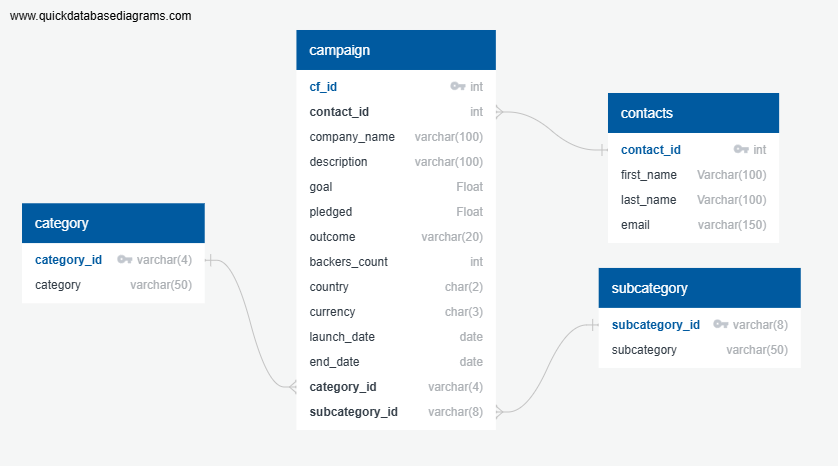

# ETL Pipeline for Crowdfunding Data

## Project Overview
This project focuses on building an **ETL (Extract, Transform, Load) pipeline** using **Python, Pandas, and Python dictionary methods**. The primary goal is to extract data from an Excel file, transform it into structured formats, and load it into a **PostgreSQL database**. The transformed data is exported into four CSV files before being used to create an **Entity-Relationship Diagram (ERD)** and a **table schema** for database implementation.

## Introduction
### Project Rationale and Use Case
The project simulates a real-world scenario where data is collected from different sources, processed, and stored in a relational database for analysis and decision-making. The dataset used in this project consists of **crowdfunding campaign data**, which is cleaned and structured to facilitate better financial and business insights. This project reinforces skills in **data wrangling, database schema design, and data storage**.

## Project Goals and Approach
### Goals
- Extract and transform raw **crowdfunding data** from an Excel file.
- Structure and clean the data using **Pandas** and **Python dictionary methods**.
- Generate **four CSV files**: Category, Subcategory, Campaign, and Contacts.
- Design an **Entity-Relationship Diagram (ERD)** for database representation.
- Define and implement a **PostgreSQL schema** based on the transformed data.
- Load the CSV data into a **PostgreSQL database** for structured storage and retrieval.

### Approach
1. **Data Extraction**: Import raw data from `crowdfunding.xlsx` and `contacts.xlsx`.
2. **Data Transformation**:
   - Create structured **DataFrames** for categories, subcategories, campaigns, and contacts.
   - Convert and clean data types.
   - Normalize values for consistency.
   - Assign unique IDs where needed.
3. **Data Loading**:
   - Export transformed data into CSV files.
   - Design **ERD** to map relationships between entities.
   - Define **PostgreSQL schema** with appropriate primary and foreign keys.
   - Upload CSV files into **PostgreSQL database** and verify data integrity.

## File Structure
```
📂 Crowdfunding_ETL
├── 📂 resources                # Folder containing input and output data files
│   ├── crowdfunding.xlsx        # Raw crowdfunding campaign data
│   ├── contacts.xlsx            # Raw contacts data
│   ├── campaign.csv             # Processed campaign data
│   ├── category.csv             # Processed category data
│   ├── contacts.csv             # Processed contacts data
│   ├── subcategory.csv          # Processed subcategory data
├── crowdfunding_ETL.ipynb       # Jupyter Notebook for ETL process
├── crowdfunding_db_ERD.png      # Entity-Relationship Diagram
├── crowdfunding_db_schema.sql   # PostgreSQL database schema
```

### Entity-Relationship Diagram


## Installation and Usage Instructions
### Prerequisites
Ensure you have the following installed:
- Python 
- PostgreSQL
- Required Python Libraries:
  ```python
  import pandas as pd
  import json
  import numpy as np
  ```

### Installation Steps
1. Clone the repository:
   ```bash
   git clone https://github.com/dagimg16/Crowdfunding_ETL.git
   ```
2. Navigate to the project directory:
   ```bash
   cd Crowdfunding_ETL
   ```
3. Install required dependencies:
   ```bash
   pip install pandas numpy 
   ```
4. Set up PostgreSQL database:
   - Create a database named `crowdfunding_db`
   - Run `crowdfunding_db_schema.sql` to create tables
5. Run the ETL script:
   ```bash
   jupyter notebook crowdfunding_ETL.ipynb
   ```

## Additional Explanations
### Key Data Transformations
- **Category & Subcategory DataFrames**:
  - Extract category titles and assign **unique category IDs**.
  - Extract subcategory titles and assign **unique subcategory IDs**.
  - Save to `category.csv` and `subcategory.csv`.

- **Campaign DataFrame**:
  - Standardize and rename columns.
  - Convert numerical columns (`goal`, `pledged`, etc.) to **float**.
  - Convert timestamps (`launched_at`, `deadline`) to **datetime format**.
  - Map **category_id** and **subcategory_id** for foreign key reference.
  - Save to `campaign.csv`.

- **Contacts DataFrame**:
  - Extract and split **full names** into `first_name` and `last_name`.
  - Standardize data formatting.
  - Save to `contacts.csv`.

### ERD and Schema Design
- The **ERD** represents relationships between **campaigns, categories, subcategories, and contacts**.
- The **PostgreSQL schema** enforces **data integrity** using primary and foreign keys.

## Conclusion
This project demonstrates the end-to-end process of **data extraction, transformation, and loading** (ETL). It reinforces **data wrangling skills** using Python, **database schema design**, and **PostgreSQL database management**. The ETL pipeline ensures structured data storage, making it easier for businesses to analyze crowdfunding campaigns efficiently.

## Team Members
- **Dagim Girma**  
- **Elena Shchepotikina** 
- **Sergio Guerrero** 
- **Ricia Daniels** 

